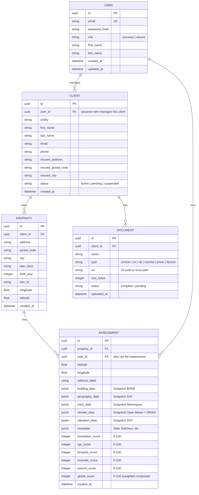

# Architecture — Prévia Risk Platform

> **Date :** 23 juillet 2026  
> **Statut :** Proposition — à valider avant implémentation  
> **Auteur :** Agent collecteur / Architecture

---

## Table des matières

1. [État des lieux : architecture actuelle](#1-État-des-lieux--architecture-actuelle)
2. [Architecture cible : monorepo Front + Back](#2-architecture-cible--monorepo-front--back)
3. [Stack technique](#3-stack-technique)
4. [Structure du monorepo](#4-structure-du-monorepo)
5. [Modèle de données (base)](#5-modèle-de-données-base)
6. [Contrats API](#6-contrats-api)
7. [Sécurité](#7-sécurité)
8. [Plan de migration](#8-plan-de-migration)
9. [Workflow de développement](#9-workflow-de-développement)
10. [Questions ouvertes](#10-questions-ouvertes)

---

## 1. État des lieux : architecture actuelle

### Diagramme

```
┌──────────────────────────────────────────────────────────────────┐
│                        NAVIGATEUR (browser)                      │
│                                                                  │
│  ┌─────────────┐  ┌──────────────┐  ┌─────────────────────────┐ │
│  │  Router SPA  │  │  DataStore   │  │  Risk Orchestrator      │ │
│  │  (router.ts) │  │  (data.ts)   │  │  (risk-orchestrator.ts) │ │
│  │              │  │  Mémoire     │  │                         │ │
│  │  · switchView │  │  volatile    │  │  · fetchRisks()        │ │
│  │  · navigateTo│  │  seed data   │  │  · fetchClimate()      │ │
│  │  · sub-tabs  │  │  pas de      │  │  · fetchBuilding()     │ │
│  │              │  │  persistence │  │  · fetchCatnat()       │ │
│  └─────────────┘  └──────────────┘  │  · fetchWaterwayDist() │ │
│                                      │  · fetchForestDist()   │ │
│  ┌──────────────────────────────────┘                         │ │
│  │                                         + scoring-engine.ts │ │
│  │  ┌────────────┐  ┌──────────┐  ┌───────┴──────────────┐    │ │
│  │  │ Auth UI    │  │ Views    │  │  Results Panel       │    │ │
│  │  │ (auth.ts)  │  │ clients  │  │  (results-panel.ts)  │    │ │
│  │  │ simulé     │  │ assureurs│  │  affichage pur      │    │ │
│  │  │            │  │ settings │  │                      │    │ │
│  │  └────────────┘  │ etc.    │  └──────────────────────┘    │ │
│  │                  └──────────┘                               │ │
│  │                                                              │ │
│  │  Vite Proxy (vite.config.ts)                                 │ │
│  │  /bdnb-api → api.bdnb.io                                    │ │
│  │  /georisques-api → georisques.gouv.fr                       │ │
│  │  /ign-geocodage → data.geopf.fr                             │ │
│  │  /ban-api → api-adresse.data.gouv.fr                        │ │
│  └──────────────────────────────────────────────────────────────┘ │
└──────────────────────────────────────────────────────────────────┘
```

### Problèmes identifiés

| # | Problème | Détail | Gravité |
|---|---|---|---|
| 1 | **Données volatiles** | `DataStore` en mémoire → perdu au refresh, pas de partage entre sessions | 🔴 Critique |
| 2 | **Tokens exposés** | `VITE_GEORISQUES_V2_TOKEN` dans le bundle browser → n'importe qui peut le récupérer | 🔴 Critique |
| 3 | **Business logic visible** | Scoring engine, formules de pondération, poids des risques → tout est en clair dans les source maps | 🔴 Critique |
| 4 | **Auth simulée** | Pas de JWT, pas de session, pas de protection des routes | 🔴 Critique |
| 5 | **CORS précaire** | Dépend du Vite proxy → pas viable en prod sans backend | 🟡 Important |
| 6 | **Performance** | 6+ appels API depuis le browser → lent sur mobile/3G | 🟡 Important |
| 7 | **Testing impossible** | Script Node.js cassé (fetch browser), test E2E compliqué | 🟡 Important |
| 8 | **Pas d'historique** | Les assessments ne sont pas persistés → impossible de suivre l'évolution | 🟡 Important |

---

## 2. Architecture cible : monorepo Front + Back

### Diagramme

```
┌──────────────────────────┐     ┌──────────────────────────────────────────────┐
│     packages/front       │     │               packages/api                   │
│  (Vite SPA — browser)    │     │         (Node.js — serveur)                   │
│                          │     │                                              │
│  ┌────────────────────┐  │     │  ┌────────────────┐  ┌──────────────────┐   │
│  │ UI Layer           │  │     │  │ Routes          │  │ Services         │   │
│  │                    │  │     │  │                │  │                  │   │
│  │ · results-panel    │  │────┼──│ POST /api/auth   │  │ · auth (JWT)    │   │
│  │ · climate-map      │  │     │  │ POST /api/assess │─▶│ · georisques    │───┼──▶ Géorisques API
│  │ · 3D house         │  │     │  │ CRUD /clients   │  │ · bdnb          │───┼──▶ BDNB API
│  │ · views            │  │     │  │ CRUD /properties │  │ · ign           │───┼──▶ IGN API
│  │ · router           │  │     │  │ GET /assessments │  │ · open-meteo   │───┼──▶ Open-Meteo
│  └────────────────────┘  │     │  │ GET /users       │  │ · scoring       │   │
│                          │     │  │ POST /uploads    │  │ · cache         │   │
│  ┌────────────────────┐  │     │  └────────────────┘  └──────────────────┘   │
│  │ API Client Layer   │  │     │                                              │
│  │ (api/*.ts)         │  │     │  ┌──────────────────────────────────────┐    │
│  │ fetch('/api/...')  │  │     │  │ Database Layer                       │    │
│  └────────────────────┘  │     │  │                                      │    │
│                          │     │  │  ┌──────────┐  ┌──────────────────┐  │    │
│  ┌────────────────────┐  │     │  │  │ SQLite   │  │ PostgreSQL (prod)│  │    │
│  │ Auth (JWT stored)  │  │     │  │  │ (dev)    │  │ (render/aws)    │  │    │
│  └────────────────────┘  │     │  │  └──────────┘  └──────────────────┘  │    │
│                          │     │  └──────────────────────────────────────┘    │
│  ┌────────────────────┐  │     │                                              │
│  │ Cache: SW / IndexDB│  │     │  ┌──────────────────┐                        │
│  └────────────────────┘  │     │  │ Cache (Redis)    │                        │
│                          │     │  │ assessments TTL  │                        │
│                          │     │  │ 24h par coords   │                        │
│                          │     │  └──────────────────┘                        │
└──────────────────────────┘     └──────────────────────────────────────────────┘
```

### Flux : assessment

```
Front                           Back                        APIs Externes
 │                               │                            │
 │  POST /api/risk/assess        │                            │
 │  { lat, lon, address, banId } │                            │
 │ ──────────────────────────────▶                            │
 │                               │                            │
 │                               ├── georisquesService ──────▶│
 │                               ├── bdnbService      ──────▶│
 │                               ├── ignService       ──────▶│
 │                               ├── openMeteoService ──────▶│
 │                               ├── driasLookup (cache)     │
 │                               │                            │
 │                               ├── scoringService.compute()│
 │                               │                            │
 │                               ├── Save assessment en DB   │
 │                               │                            │
 │  200 { assessment, scores }   │                            │
 │ ◀─────────────────────────────│                            │
 │                               │                            │
 │  Affiche dans results-panel   │                            │
```

---

## 3. Stack technique

### Frontend (packages/front)

| Technologie | Version | Usage |
|---|---|---|
| **Vite** | ^8.1.1 | Build tool, dev server |
| **TypeScript** | ~6.0.2 | Langage |
| **Material Web** | ^2.5.0 | Composants UI |
| **Leaflet** | ^1.9.4 | Carte climat/risques |
| **Three.js** | ^0.185.1 | 3D house viewer |
| **Maplibre GL** | ^5.24.0 | Tuiles vectorielles |
| **Proj4** | ^2.20.9 | Projections carto |

→ **Aucune dépendance backend** côté front. Toute la logique métier est remplacée par des `fetch('/api/...')`.

### Backend (packages/api) — Proposition

| Technologie | Choix | Pourquoi |
|---|---|---|
| **Runtime** | **Node.js** (ou **Bun**) | Équipe TypeScript déjà en place, code à partager (types) |
| **Framework** | **Hono** | Léger, performant, support natif des Workers, middleware JWT, compatible Node.js/Deno/Bun/CF Workers |
| **Validation** | **Zod** | Validation des inputs, infère les types TS automatiquement |
| **ORM** | **Drizzle** | Type-safe, léger, migrations SQL, pas de magie — contrairement à Prisma |
| **Base de données** | **SQLite** (dev via Turso/libsql) → **PostgreSQL** (prod) | Drizzle supporte les deux avec le même schéma |
| **Auth** | **JWT** (jsonwebtoken + bcrypt) | Simple, pas de session state |
| **Uploads** | **Multer** (dev) → **S3** (prod) | Stockage local → cloud |
| **Cache** | **In-memory Map** → **Redis** (prod) | Cache des assessments 24h |
| **Tests** | **Vitest** | Même écosystème que Vite |
| **Proxy dev** | Vite proxy → backend | En dev, Vite proxy `/api/*` vers le backend |

#### Pourquoi Hono plutôt qu'Express ?

| Critère | Express | Hono |
|---|---|---|
| Taille | Lourd (dépendances) | Ultrason (~20kB) |
| Performance | Moyen | Très rapide (Régalien natif) |
| TypeScript | Correct | Excellent (types natifs) |
| JWT middleware | npm package | Intégré `@hono/jwt` |
| Validation | Joi/Zod manuel | `@hono/zod-openapi` |
| Multi-runtime | Node only | Node/Deno/Bun/CF Workers |
| Middleware ecosystem | Très large | Croît vite |

**Recommendation : Hono** (plus moderne, meilleure DX TypeScript, compatible Workers si on veut serverless un jour).

---

## 4. Structure du monorepo

```
/Insurance
├── ARCHITECTURE.md                         ← Ce document
├── package.json                            ← Monorepo root (workspaces)
├── tsconfig.base.json                      ← Config TS partagée
│
├── packages/
│   ├── shared/                             ← NOUVEAU : types partagés
│   │   ├── package.json                    ←   @previa/shared
│   │   └── src/
│   │       ├── schema.ts                   ←   Source unique de vérité (ex risk-assessment/schema.ts)
│   │       └── types.ts                    ←   API request/response types
│   │
│   ├── front/                              ← Ancien dashboard/
│   │   ├── index.html
│   │   ├── vite.config.ts                  ← Proxy /api → localhost:3001
│   │   ├── package.json
│   │   ├── tsconfig.json
│   │   │
│   │   ├── public/
│   │   │   └── *.obj, *.mtl                ← 3D house assets
│   │   │
│   │   └── src/
│   │       ├── main.ts                     ← Entry point (inchangé)
│   │       ├── base.css
│   │       ├── style.css
│   │       │
│   │       ├── api/                        ← NOUVEAU : client HTTP
│   │       │   ├── client.ts               ←   fetch wrapper (cookies auto)
│   │       │   ├── auth.ts                 ←   POST /api/auth/login, etc.
│   │       │   ├── risks.ts                ←   POST /api/risk/assess
│   │       │   ├── clients.ts              ←   CRUD /api/clients
│   │       │   ├── properties.ts           ←   CRUD /api/properties
│   │       │   ├── assessments.ts          ←   GET /api/assessments
│   │       │   └── uploads.ts              ←   POST /api/uploads
│   │       │
│   │       ├── router.ts                   ← Inchangé (SPA routing)
│   │       ├── context.ts                  ← Ancien context.ts
│   │       ├── data.ts                     ← SUPPRIMÉ (remplacé par api/)
│   │       │
│   │       ├── views/                      ← Inchangé (UI pure)
│   │       │   ├── auth/auth.ts            ←   Appelle api/auth.ts
│   │       │   ├── clients/clients.ts      ←   Appelle api/clients.ts
│   │       │   ├── property-risk/          ←   Appelle api/risks.ts
│   │       │   ├── climate-map/            ←   Garde les composants carte
│   │       │   └── ... (autres views)
│   │       │
│   │       └── risk-assessment/            ← À SUPPRIMER (vers backend)
│   │           ├── risk-orchestrator.ts     ←   DÉPLACÉ dans packages/api
│   │           ├── scoring-engine.ts       ←   DÉPLACÉ dans packages/api
│   │           ├── schema.ts               ←   REMPLACÉ par @previa/shared/schema
│   │           ├── results-panel.ts        ←   GARDÉ dans front (UI pure)
│   │           └── lookup/                 ←   DÉPLACÉ dans packages/api
│   │
│   └── api/                                ← NOUVEAU : backend
│       ├── package.json
│       ├── .env                            ← Tokens API, DB strings 🔒
│       ├── .env.example
│       ├── tsconfig.json
│       │
│       ├── drizzle.config.ts
│       └── src/
│           ├── index.ts                    ← Entry point (Hono app.listen)
│           │
│           ├── config/
│           │   ├── env.ts                  ← Validation des .env avec Zod
│           │   └── cors.ts
│           │
│           ├── middleware/
│           │   ├── auth.ts                 ← JWT verification
│           │   ├── cache.ts                ← Cache headers / Redis
│           │   └── error.ts                ← Error handler global
│           │
│           ├── routes/
│           │   ├── auth.routes.ts          ← /api/auth/*
│           │   ├── clients.routes.ts       ← /api/clients/*
│           │   ├── properties.routes.ts    ← /api/properties/*
│           │   ├── assessments.routes.ts   ← /api/assessments/*
│           │   ├── risk.routes.ts          ← /api/risk/*
│           │   └── uploads.routes.ts       ← /api/uploads/*
│           │
│           ├── services/
│           │   ├── auth.service.ts         ← JWT sign/verify, hash
│           │   ├── georisques.service.ts   ← ← De l'ancien orchestrator
│           │   ├── bdnb.service.ts         ← ← De l'ancien orchestrator
│           │   ├── ign.service.ts          ← ← De l'ancien orchestrator
│           │   ├── open-meteo.service.ts   ← ← De l'ancien orchestrator
│           │   ├── wfs.service.ts          ← ← De l'ancien orchestrator
│           │   ├── drias.service.ts        ← ← De l'ancien orchestrator
│           │   ├── dvf.service.ts          ← ← De l'ancien orchestrator
│           │   ├── orchestrator.service.ts ← ← De l'ancien orchestrator
│           │   ├── scoring.service.ts      ← ← De l'ancien scoring-engine
│           │   ├── cache.service.ts        ← Cache Map/Redis
│           │   └── upload.service.ts       ← File handling
│           │
│           ├── database/
│           │   ├── schema.ts               ← Drizzle schema (tables)
│           │   ├── migrations/             ← Drizzle migrations SQL
│           │   └── seed.ts                 ← Seed data (→ DB)
│           │
│           └── shared/                     ← Types partagés
│               └── (alias)                 ← NE PAS COPIER — import via workspace:*
│
├── .specify/                               ← SDD inchangé
│   └── specs/
│       └── 001-connect-live-data-to-risk-hub/
│
└── README.md
```

---

## 5. Modèle de données (base)

### Schéma conceptuel



### Tables Drizzle

```typescript
// packages/api/src/database/schema.ts
import { sqliteTable, text, integer, real, blob } from 'drizzle-orm/sqlite-core';

export const users = sqliteTable('users', {
  id: text('id').primaryKey().$defaultFn(uuid),
  email: text('email').notNull().unique(),
  passwordHash: text('password_hash').notNull(),
  role: text('role', { enum: ['assureur', 'assure'] }).notNull().default('assureur'),
  firstName: text('first_name').notNull(),
  lastName: text('last_name').notNull(),
  createdAt: text('created_at').notNull().$defaultFn(now),
  updatedAt: text('updated_at').notNull().$defaultFn(now),
});

export const clients = sqliteTable('clients', {
  id: text('id').primaryKey().$defaultFn(uuid),
  userId: text('user_id').references(() => users.id).notNull(),
  civility: text('civility'),
  firstName: text('first_name').notNull(),
  lastName: text('last_name').notNull(),
  email: text('email'),
  phone: text('phone'),
  insuredAddress: text('insured_address'),
  insuredPostalCode: text('insured_postal_code'),
  insuredCity: text('insured_city'),
  status: text('status', { enum: ['active', 'pending', 'suspended'] }).default('active'),
  createdAt: text('created_at').notNull().$defaultFn(now),
});

export const properties = sqliteTable('properties', {
  id: text('id').primaryKey().$defaultFn(uuid),
  clientId: text('client_id').references(() => clients.id).notNull(),
  address: text('address').notNull(),
  postalCode: text('postal_code'),
  city: text('city'),
  dpeClass: text('dpe_class'),
  builtYear: integer('built_year'),
  banId: text('ban_id'),
  longitude: real('longitude'),
  latitude: real('latitude'),
  createdAt: text('created_at').notNull().$defaultFn(now),
});

export const assessments = sqliteTable('assessments', {
  id: text('id').primaryKey().$defaultFn(uuid),
  propertyId: text('property_id').references(() => properties.id),
  userId: text('user_id').references(() => users.id),
  // Snapshot de l'adresse au moment de l'évaluation
  addressLabel: text('address_label').notNull(),
  longitude: real('longitude').notNull(),
  latitude: real('latitude').notNull(),
  // Données brutes — JSON snapshots (immutables)
  buildingData: text('building_data'),         // JSON string — BuildingData
  geographyData: text('geography_data'),       // JSON string — IgnData
  risksData: text('risks_data'),               // JSON string — RiskData
  climateData: text('climate_data'),           // JSON string — ClimateData
  valuationData: text('valuation_data'),       // JSON string — DvfData
  metadataData: text('metadata_data'),         // JSON string — AssessmentMetadata
  // Scores calculés
  inondationScore: integer('inondation_score'),
  rgaScore: integer('rga_score'),
  tempeteScore: integer('tempete_score'),
  incendieScore: integer('incendie_score'),
  seismeScore: integer('seisme_score'),
  globalScore: integer('global_score'),
  // Metadata
  createdAt: text('created_at').notNull().$defaultFn(now),
});

export const documents = sqliteTable('documents', {
  id: text('id').primaryKey().$defaultFn(uuid),
  clientId: text('client_id').references(() => clients.id).notNull(),
  name: text('name').notNull(),
  type: text('type', {
    enum: ['contrat', 'cni', 'rib', 'mandat', 'photo', 'facture', 'autre']
  }).notNull(),
  url: text('url').notNull(),
  sizeBytes: integer('size_bytes'),
  status: text('status', { enum: ['complete', 'pending'] }).default('pending'),
  uploadedAt: text('uploaded_at').notNull().$defaultFn(now),
});
```

---

## 6. Contrats API

### 6.1 Auth

#### `POST /api/auth/register`

```
Request:
{
  "email": "user@example.fr",
  "password": "s3cur3P@ss",
  "firstName": "Jean",
  "lastName": "Dupont",
  "role": "assureur"          // "assureur" | "assure"
}

Response 201:
{
  "token": "eyJhbGciOiJIUzI1NiIs...",
  "user": {
    "id": "uuid",
    "email": "user@example.fr",
    "firstName": "Jean",
    "lastName": "Dupont",
    "role": "assureur"
  }
}

Error 409: { "error": "EMAIL_EXISTS", "message": "Cet email est déjà utilisé" }
```

#### `POST /api/auth/login`

```
Request:
{
  "email": "user@example.fr",
  "password": "s3cur3P@ss"
}

Response 200:
{
  "token": "eyJhbGciOiJIUzI1NiIs...",
  "user": { ... }
}

Error 401: { "error": "INVALID_CREDENTIALS", "message": "Email ou mot de passe incorrect" }
```

#### `GET /api/auth/me`

```
Headers: Authorization: Bearer <token>

Response 200:
{
  "user": { ... }
}

Error 401: { "error": "UNAUTHORIZED" }
```

### 6.2 Risk Assessment

#### `POST /api/risk/assess`

**Point d'entrée unique** — le backend orchestre tout, le front reçoit le résultat final.

```
Request:
{
  "latitude": 48.868831,
  "longitude": 2.330992,
  "address": "8 Rue de la Paix 75002 Paris",
  "banId": "75102_6998_00008"            // optionnel
}

Response 200:
{
  "assessmentId": "uuid",
  "property": { /* BuildingData */ },
  "valuation": { /* DvfData */ },
  "geography": { /* IgnData */ },
  "risks": { /* RiskData */ },
  "climate": { /* ClimateData */ },
  "scores": {
    "inondation": 45,
    "rga": 72,
    "tempete": 18,
    "incendie": 5,
    "seisme": 10,
    "global": 38
  },
  "metadata": {
    "assessmentDate": "2026-07-23",
    "dataFreshness": { /* par provider */ }
  }
}
```

#### `GET /api/risk/assess/:id`

```
Response 200: Même shape que POST /assess
Error 404: { "error": "NOT_FOUND" }
```

### 6.3 Clients

```
GET    /api/clients                    → Client[]
GET    /api/clients/:id                → Client + properties
POST   /api/clients                    → Client (created)
PUT    /api/clients/:id                → Client (updated)
DELETE /api/clients/:id                → { success: true }

GET    /api/clients/:id/properties     → Property[]
GET    /api/clients/:id/assessments    → Assessment[]
GET    /api/clients/:id/documents      → Document[]
```

### 6.4 Properties

```
GET    /api/properties                 → Property[]
GET    /api/properties/:id             → Property + assessments
POST   /api/properties                 → Property (created)
PUT    /api/properties/:id             → Property (updated)
DELETE /api/properties/:id             → { success: true }

GET    /api/properties/:id/assessments  → Assessment[]
```

### 6.5 Assessments

```
GET    /api/assessments                → Assessment[]
GET    /api/assessments/:id            → Assessment (full)
DELETE /api/assessments/:id            → { success: true }
```

### 6.6 Uploads

```
POST   /api/uploads                    → { url, name, size }
  Content-Type: multipart/form-data
  Fields: file (binary), clientId, type (photo|facture|document)
```

### 6.7 Users (admin)

```
GET    /api/users                      → User[]
GET    /api/users/:id                  → User
```

---

## 7. Sécurité

### 7.1 Tokens API — jamais dans le bundle

```
🔴 AVANT (dans le browser) :
  VITE_GEORISQUES_V2_TOKEN=abc123  → visible dans les source maps

✅ APRÈS (dans le .env du backend) :
  # packages/api/.env
  GEORISQUES_V2_TOKEN=abc123       → jamais exposé au front
  BDNB_API_KEY=...
  ...
```

### 7.2 JWT — sessions via HTTP-only cookies

> **Pourquoi pas localStorage ?** Les tokens dans localStorage sont lisibles par n'importe quel script JS (XSS). Pour une plateforme d'assurance manipulant des données sensibles (RGPD, données personnelles), les cookies `httpOnly + SameSite=Lax` sont obligatoires.

```
Frontend                  Backend
   │                        │
   │  POST /api/auth/login  │
   │  { email, password }   │
   │ ──────────────────────▶│
   │                        │── Vérifie bcrypt hash
   │                        │── Signe JWT (exp: 24h)
   │                        │── Set-Cookie: token=<jwt>;
   │                        │      httpOnly; SameSite=Lax;
   │                        │      Secure (prod)
   │  { user }              │
   │ ◀──────────────────────│
   │                        │
   │  (cookie envoyé auto   │
   │   par le navigateur)   │
   │                        │
   │  GET /api/clients      │
   │  (cookie: token=<jwt>) │
   │ ──────────────────────▶│
   │                        │── Vérifie JWT depuis cookie
   │                        │── Extrait userId du payload
   │  { clients[] }         │
   │ ◀──────────────────────│
```

### 7.3 Validation — tout est validé côté backend

```typescript
// packages/api/src/routes/clients.routes.ts
import { z } from 'zod';
import { zValidator } from '@hono/zod-validator';

const createClientSchema = z.object({
  firstName: z.string().min(1).max(100),
  lastName: z.string().min(1).max(100),
  email: z.string().email().optional(),
  phone: z.string().optional(),
  insuredAddress: z.string().optional(),
  insuredPostalCode: z.string().length(5).optional(),
  insuredCity: z.string().optional(),
});

app.post('/api/clients', zValidator('json', createClientSchema), async (c) => {
  const data = c.req.valid('json');
  // data est typé automatiquement ✅
});
```

### 7.4 Rate limiting & Cache

```typescript
// packages/api/src/services/cache.service.ts
const assessmentCache = new Map<string, CacheEntry>();

export async function getOrAssess(params: AssessParams): Promise<Result> {
  const cacheKey = `${params.latitude.toFixed(3)},${params.longitude.toFixed(3)}`;
  
  const cached = assessmentCache.get(cacheKey);
  if (cached && (Date.now() - cached.timestamp) < 24 * 60 * 60 * 1000) {
    return cached.data; // Cache hit (24h TTL)
  }
  
  const result = await runFullAssessment(params);
  assessmentCache.set(cacheKey, { data: result, timestamp: Date.now() });
  return result;
}
```

---

## 8. Plan de migration

### Phase 0 — Préparation (½ journée)

- [ ] Créer la structure du monorepo (`packages/front`, `packages/api`)
- [ ] Mettre en place les workspaces npm/pnpm
- [ ] Configurer `tsconfig.base.json` partagé
- [ ] Initialiser `packages/api` avec Hono + Drizzle + Zod
- [ ] Utiliser **Turso/libSQL** (SQLite embarqué) pour le dev → zéro dépendance lourde

### Phase 1 — Backend : auth + CRUD (2 jours)

- [ ] Modèle de données Drizzle + migration initiale
- [ ] Routes auth (`/register`, `/login`, `/me`)
- [ ] Routes CRUD clients
- [ ] Routes CRUD properties
- [ ] Routes CRUD assessments (lecture seule pour commencer)
- [ ] Seed la base avec les données existantes de `data.ts`
- [ ] Branch `auth/auth.ts` sur l'API

### Phase 2 — Backend : risk orchestrator (2 jours)

- [ ] Déplacer `risk-orchestrator.ts` → `services/orchestrator.service.ts`
- [ ] Déplacer les services individuels (georisques, bdnb, ign, open-meteo, wfs)
- [ ] Déplacer `scoring-engine.ts` → `services/scoring.service.ts`
- [ ] Déplacer les lookups (drias, dvf) → services
- [ ] Créer `POST /api/risk/assess` — endpoint unique
- [ ] Ajouter le cache 24h
- [ ] Ajouter le rate limiting

### Phase 3 — Frontend : remplacer DataStore par API (1 jour)

- [ ] Créer `api/client.ts` — fetch wrapper avec JWT
- [ ] Créer `api/auth.ts`, `api/clients.ts`, `api/properties.ts`, `api/risks.ts`
- [ ] Modifier les views pour appeler l'API au lieu de `DataStore`
- [ ] Supprimer `data.ts` (ou garder comme fallback seed)
- [ ] Modifier `property-risk.ts` : `POST /api/risk/assess` au lieu de l'orchestrateur
- [ ] Modifier `vite.config.ts` : ajouter proxy `/api → http://localhost:3001`

### Phase 4 — Uploads + Documents (1 jour)

- [ ] Route `POST /api/uploads`
- [ ] Route `GET /api/clients/:id/documents`
- [ ] Upload UI dans la vue client
- [ ] Stockage local (dev) → S3 (prod)

### Phase 5 — Polish + Tests (1 jour)

- [ ] Tests backend (Vitest)
- [ ] Tests front (Vitest + Playwright)
- [ ] Gestion d'erreurs globale
- [ ] Logs structurés
- [ ] Documentation API (OpenAPI via `@hono/zod-openapi`)

### Total estimé : **~7 jours** (une semaine de travail)

---

## 9. Workflow de développement

### En local

```bash
# Terminal 1 : Backend
cd packages/api
cp .env.example .env          # Éditer avec vos tokens
npm run dev                   # Hono → http://localhost:3001

# Terminal 2 : Frontend
cd packages/front
npm run dev                   # Vite → http://localhost:5173
                              # Vite proxy /api → localhost:3001
```

```typescript
// packages/front/vite.config.ts
export default defineConfig({
  server: {
    proxy: {
      '/api': {
        target: 'http://localhost:3001',
        changeOrigin: true,
      },
      // On garde les proxies externes pour les tuiles carto
      '/osm-tiles': { ... },
      '/georisques-wms': { ... },
      // Plus de proxy BDNB / Géorisques / IGN → tout passe par /api
    },
  },
});
```

### Base de données

```bash
# Dev : SQLite (fichier local, zéro setup)
npm run db:generate    # Drizzle Kit → génère les migrations
npm run db:push        # Push le schéma → SQLite
npm run db:seed        # Seed data

# Prod : PostgreSQL
npm run db:migrate     # Applique les migrations sur PostgreSQL
```

---

## 10. Questions ouvertes

Avant de commencer l'implémentation, il faut trancher :

| Question | Options | Recommandation |
|---|---|---|
| **Runtime backend** | Node.js vs Bun vs Deno | **Node.js** (stabilité, écosystème) |
| **Framework** | Hono vs Express vs Fastify | **Hono** (léger, typesafe, multi-runtime) |
| **Database** | SQLite vs PostgreSQL | **SQLite en dev / PostgreSQL en prod** (via Drizzle) |
| **ORM** | Drizzle vs Prisma | **Drizzle** (type-safe, pas de magie, SQL brut) |
| **Cache** | In-memory Map vs Redis | **Map en dev / Redis en prod** (interface simple) |
| **Auth tokens** | JWT + localStorage vs HTTP-only cookies | **HTTP-only cookies** — localStorage est vulnérable au XSS ; pour une plateforme d'assurance (données sensibles), les cookies httpOnly + SameSite=Lax sont obligatoires dès le départ |
| **Hébergement** | VPS vs Cloudflare Workers vs Serverless | **À décider plus tard** — Hono permet de migrer facilement |
| **Partage des types** | Monorepo workspace vs copie manuelle | **Workspace npm** (`@previa/shared`) — les types schema.ts sont partagés |

---

## Annexes

### A. Dépendances backend (package.json)

```json
{
  "name": "@previa/api",
  "version": "0.1.0",
  "type": "module",
  "dependencies": {
    "hono": "^4.x",
    "@hono/zod-validator": "^0.x",
    "@hono/jwt": "^0.x",
    "zod": "^3.x",
    "drizzle-orm": "^0.x",
    "@libsql/client": "^0.x",
    "bcryptjs": "^2.x",
    "jsonwebtoken": "^9.x",
    "multer": "^1.x"
  },
  "devDependencies": {
    "drizzle-kit": "^0.x",
    "typescript": "~6.0.2",
    "vitest": "^2.x",
    "@types/bcryptjs": "^2.x",
    "@types/jsonwebtoken": "^9.x",
    "@types/multer": "^1.x"
  }
}
```

### B. Variables d'environnement (backend)

```bash
# packages/api/.env.example

# Port du serveur
PORT=3001

# Base de données
DATABASE_URL=file:./data/previa.db    # SQLite (dev)
# DATABASE_URL=postgresql://...       # PostgreSQL (prod)

# JWT
JWT_SECRET=change-me-in-production
JWT_EXPIRATION=24h

# Tokens API (JAMAIS dans le front)
GEORISQUES_V2_TOKEN=
BDNB_API_KEY=

# Upload
UPLOAD_DIR=./uploads
# S3_BUCKET=previa-uploads          # (prod)
# S3_REGION=eu-west-1
```

### C. Types partagés

Le fichier `packages/front/src/risk-assessment/schema.ts` (existant) devient un workspace partagé :

```json
// packages/shared/package.json
{
  "name": "@previa/shared",
  "exports": {
    "./schema": "./src/schema.ts"
  }
}
```

```json
// packages/api/package.json
{
  "dependencies": {
    "@previa/shared": "workspace:*"
  }
}
```

```json
// packages/front/package.json
{
  "dependencies": {
    "@previa/shared": "workspace:*"
  }
}
```

---

> **Prochaine étape :** Valider ce document d'architecture, puis attaquer la **Phase 0** (structure monorepo) et la **Phase 1** (backend auth + CRUD).
